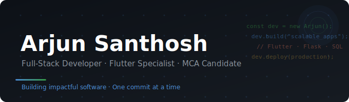

---

## About Me

I'm a passionate MCA student and full-stack developer with a strong foundation in Flutter and modern web technologies. I specialize in building scalable, real-world applications with clean backend logic, robust API integrations, and optimized database design.

- 🔭 &nbsp;Currently building with **PHP**, **Python Flask**, and **SQL**
- 🌱 &nbsp;Currently learning **.NET** and **Laravel**
- 💬 &nbsp;Ask me about **Flutter** or **Python Flask**
- ✍️ &nbsp;I write technical articles on [Medium](https://medium.com/@arjunsanthosh440)
- 🏆 &nbsp;Recognized for leadership in innovation initiatives and hackathon achievements
- 📫 &nbsp;Reach me at **arjunsanthoshcc@gmail.com**

---

## Tech Stack

<table>
  <tr>
    <td><strong>Mobile & Frontend</strong></td>
    <td>
      
      
      
      
      
      
    </td>
  </tr>
  <tr>
    <td><strong>Backend & APIs</strong></td>
    <td>
      
      
      
      
      
      
    </td>
  </tr>
  <tr>
    <td><strong>Databases</strong></td>
    <td>
      
      
      
      
      
      
    </td>
  </tr>
  <tr>
    <td><strong>DevOps & Tools</strong></td>
    <td>
      
      
      
      
      
    </td>
  </tr>
</table>

---

## GitHub Stats

  
  

  

---

## Trophies

  

---

  <i>Open to collaborations, exciting projects, and new opportunities.</i>
   
  <b>Let's build something impactful together.</b>

